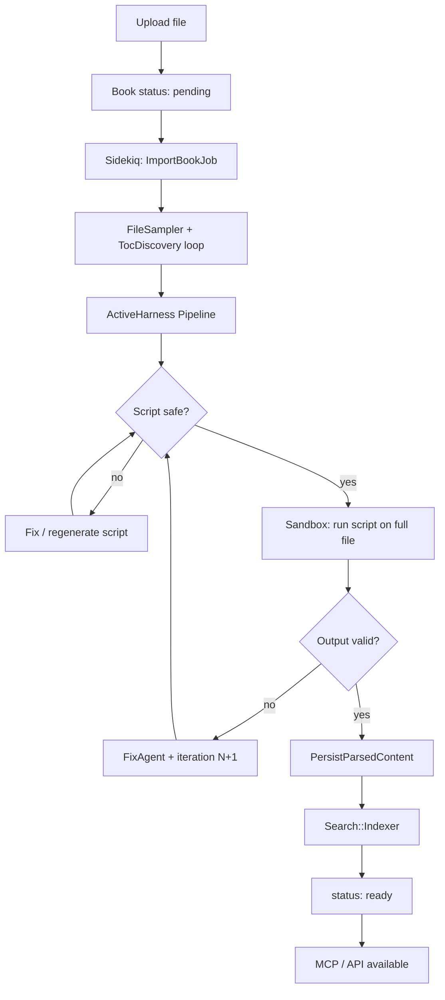
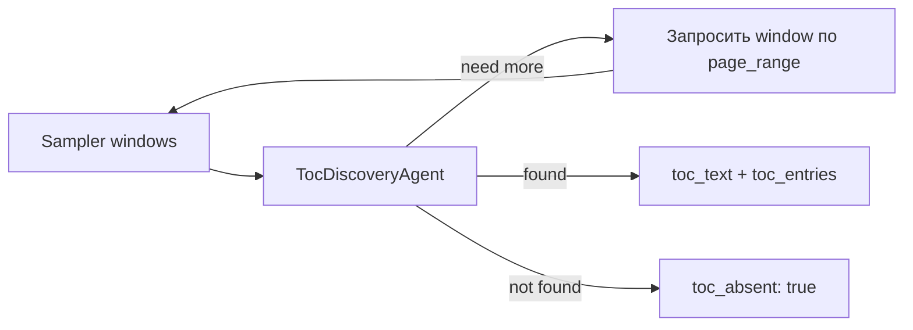

# AI-агент для импорта книг — план работ

> Статус: **согласовано, готов к реализации**  
> LLM: **DeepSeek** (`deepseek-chat` / `deepseek-reasoner`)  
> Оркестрация: **[ActiveHarness](https://github.com/the-teacher/active_harness)**  
> Очередь: **Sidekiq** (+ Redis)  
> Sandbox: **Docker** (`parser-sandbox`)  
> Цель: заменить жёстко зашитые `Fb2::Importer` / `Pdf::Importer` на **универсальный конвейер**, который для любого загруженного файла сам разбирается в структуре и генерирует безопасный парсер.

---

## 1. Что понял из задачи

Сейчас импорт — **один синхронный Ruby-путь** на формат:

```
upload → Parser.parse → Books::PersistParsedContent → Search::Indexer → status: ready → MCP доступен
```

Ты хочешь **ИИ-агента**, который:

| # | Шаг | Смысл |
|---|-----|-------|
| 1 | Поиск и анализ структуры | LLM **ищет оглавление** (не только в начале/конце), понимает формат, страницы и главы; оглавления может не быть — тогда строим TOC при парсинге |
| 2 | Генерация Ruby-скрипта | Скрипт читает **весь** файл и выдаёт данные в наш контракт (`ParsedDocument`) |
| 3 | Проверка безопасности | Скрипт не может навредить системе |
| 4 | Запуск скрипта | Прогон на реальном файле книги |
| 5 | Цикл исправлений | Если парсинг плохой — агент правит скрипт, пока не получится |
| 6 | Индексация Elasticsearch | Как сейчас — `Search::Indexer.index_book!` |
| 7 | MCP | Как сейчас — middleware по `uid`, когда `book.ready?` |

**Ключевое:** это не разовые вызовы API, а **управляемый агентный pipeline** с памятью, логами, retry и stop-условиями — для этого и берём ActiveHarness.

---

## 2. Что остаётся без изменений (контракт системы)

MCP, REST API и Elasticsearch **не переписываем**. Меняется только слой «как из файла получить `ParsedDocument`».

### Целевая структура данных (уже есть)

```ruby
Books::ParsedDocument = Data.define(
  :title, :author, :sections, :reading_text, :pages
)

Books::ParsedSection = Data.define(
  :title, :plain_text, :depth, :position, :path,
  :children, :page_start, :page_end
)
```

### Точки интеграции (уже есть)

- `Books::PersistParsedContent` — SQLite (`books`, `sections`, `pages`)
- `Search::Indexer.index_book!` — Elasticsearch `dynamic_mcp_books`
- `Mcp::BookMiddleware` — MCP поднимается **on-demand** при `book.status == "ready"`

**Импортёр должен на выходе дать тот же `ParsedDocument`, что сейчас дают `Fb2::Parser` / `Pdf::Parser`.**

---

## 3. Архитектура высокого уровня



### Принципы

1. **HTTP upload не блокируется** — сразу redirect + `book.status = processing`, дальше **Sidekiq**.
2. **LLM никогда не получает всю книгу** — только:
   - фрагменты для **поиска оглавления** (см. §5.0–5.1);
   - **найденное оглавление** (или его часть, если очень длинное — см. ниже);
   - **одну примерную главу** (1–3 страницы текста);
   - метаданные, stderr/статистику прогона скрипта.
3. **Поиск оглавления — задача агента**, не фиксированное «стр. 1–10». TOC может быть длинным, в середине книги или **отсутствовать**.
4. **Нет TOC — не ошибка.** Скрипт парсит страницы и **собирает sections из заголовков глав** (как сейчас эвристика PDF, но в сгенерированном коде).
5. **Сгенерированный Ruby не выполняется в процессе Rails** — только в **Docker sandbox**.
6. **Скрипт пишет JSON в stdout**, Rails валидирует схему и маппит в `ParsedDocument`.
7. **ActiveHarness** — agents + pipeline + (опционально) tribunal для security review.
8. **`AI_IMPORT_ENABLED=false`** — fallback на текущие `Fb2::Importer` / `Pdf::Importer`.

---

## 4. ActiveHarness: как раскладываем роли

Структура каталогов (после `rails generate active_harness:install`):

```
app/ai/
├── prompts/
│   ├── books/toc_discovery_prompt.rb
│   ├── books/structure_analysis_prompt.rb
│   ├── books/parser_script_prompt.rb
│   ├── books/script_fix_prompt.rb
│   └── books/quality_review_prompt.rb
├── agents/
│   ├── books/toc_discovery_agent.rb       # где и как искать TOC
│   ├── books/structure_analysis_agent.rb
│   ├── books/parser_script_author_agent.rb
│   ├── books/script_fix_agent.rb
│   └── books/quality_review_agent.rb
├── tribunals/
│   └── books/script_security_tribunal.rb   # опционально: LLM + статика
├── pipelines/
│   └── books/import_pipeline.rb
└── memory/
    └── books/import_memory.rb              # контекст итераций на одну книгу
```

### DeepSeek в агентах

```ruby
model do
  use      provider: :deepseek, model: "deepseek-chat", temperature: 0.2
  fallback provider: :deepseek, model: "deepseek-reasoner"  # для сложных PDF
end
```

Env: `DEEPSEEK_API_KEY` (см. [providers.md](https://github.com/the-teacher/active_harness/blob/master/docs/common/providers.md)).

---

## 5. Pipeline по шагам (детально)

### Шаг 0 — Подготовка сэмплов (Ruby, без LLM)

**Сервис:** `Books::Import::FileSampler`

Собирает **индексируемые фрагменты** книги — не для отправки целиком в LLM, а как материал для агента поиска TOC:

| Формат | Что извлекаем локально |
|--------|------------------------|
| PDF | `page_count`, PDF outline/bookmarks (если есть), текст **окон** по 3 стр.: начало, 25%, 50%, 75%, конец; плюс оглавление-кандидаты по regex («Содержание», «Оглавление», `Chapter`, `Глава`) |
| FB2 | XML `<title>`, `<author>`, дерево `<section>` из метаданных, первые/средние/последние `<section>` |
| Прочее | MIME, расширение, первые/последние 64 KB |

Каждый фрагмент: `{ window_id, page_from, page_to, text, char_count }`.

Сохраняем в `import_artifacts` (JSON). **В LLM уходит только то, что выберет агент** (см. лимиты ниже).

#### Лимиты на контекст DeepSeek (жёстко в коде)

| Что | Лимит |
|-----|-------|
| Один фрагмент в промпт | ≤ 8 000 символов |
| Все фрагменты за один вызов TOC Discovery | ≤ 24 000 символов |
| Найденное оглавление в промпт | ≤ 12 000 символов (если длиннее — head + tail + `truncated: true`) |
| Пример главы | 1 глава, ≤ 6 000 символов (1–3 PDF-стр. или один FB2-section) |
| Quality review | статистика + 2 коротких sample, без полного текста |

**Вся книга обрабатывается только сгенерированным скриптом в Docker**, не DeepSeek.

---

### Шаг 0.5 — Поиск оглавления (LLM Agent, итеративный)

**Agent:** `Books::TocDiscoveryAgent`

Оглавление **не предполагается** ни в начале, ни в конце. Агент работает итеративно:



**Вход:** список window-фрагментов + метаданные (page_count, outline).

**Агент может вернуть:**

```json
{
  "action": "inspect_windows",
  "window_ids": ["p25-27", "p120-122"],
  "reason": "Похоже на TOC в середине книги"
}
```

Orchestrator подтягивает тексты этих окон (из sampler, без LLM) и **повторяет вызов** (max 3 раунда inspect).

**Финальный результат:**

```json
{
  "toc_found": true,
  "toc_location": { "page_from": 118, "page_to": 145 },
  "toc_text": "…",
  "toc_entries": [{ "title": "Глава 1", "page": 12, "level": 1 }],
  "toc_truncated": false
}
```

или

```json
{
  "toc_found": false,
  "toc_absent": true,
  "reason": "Оглавления нет; главы видны по заголовкам на страницах",
  "suggested_chapter_pattern": "^(Глава|Chapter)\\s+\\d+"
}
```

**Если TOC не найден** — pipeline **не останавливается**. Переходим к анализу структуры с `chapter_detection_strategy: "inline_headings"`.

**Если TOC длинное** — в LLM идёт structured `toc_entries` (parsed list), полный `toc_text` только в artifacts/лог (truncated).

---

### Шаг 1 — Анализ структуры (LLM Agent)

**Agent:** `Books::StructureAnalysisAgent`  
**Prompt:** по результату TOC Discovery + **одной примерной главе** определить формат, title/author, pagination, стратегию парсера.

**Выход (JSON, `format :json`):**

```json
{
  "detected_format": "pdf|fb2|…",
  "title": "…",
  "author": "…",
  "toc_found": true,
  "has_structured_toc": true,
  "pagination_mode": "physical|virtual",
  "toc_entries": [{ "title": "Глава 1", "page": 12, "level": 1 }],
  "chapter_detection_strategy": "from_toc|outline|inline_headings|heuristic",
  "build_toc_while_parsing": false,
  "sample_chapter": { "page_from": 12, "page_to": 14, "title": "Глава 1" },
  "parser_notes": "…",
  "suggested_gems": ["pdf-reader"],
  "confidence": 0.85
}
```

**`build_toc_while_parsing: true`** — когда `toc_found: false`, но на страницах есть заголовки глав (типичный PDF). Скрипт при обходе страниц **сам наращивает `sections`** с `page_start`/`page_end`.

---

### Шаг 2 — Генерация Ruby-скрипта (LLM Agent)

**Agent:** `Books::ParserScriptAuthorAgent`

На вход: JSON из шагов 0.5–1 + **жёсткий шаблон скрипта** + **JSON Schema результата**.

Промпт явно описывает три режима TOC:

| Режим | Поведение скрипта |
|-------|-------------------|
| `from_toc` | sections из `toc_entries`, текст глав режется по page ranges |
| `outline` | PDF bookmarks через pdf-reader |
| `inline_headings` | обход всех страниц, regex/эвристика заголовков → sections «на лету» |
| `heuristic` | fallback для FB2/XML и прочего |

Скрипт обязан:

```ruby
# frozen_string_literal: true
# book_parser.rb — GENERATED, do not edit manually
# Reads ARGV[0] (path to source file), prints JSON to stdout.

require "json"
# only allowlisted requires...

def parse_book(path)
  # ...
  {
    "title" => "...",
    "author" => "...",
    "sections" => [...],
    "pages" => ["page1 text", ...]   # OR omit pages and set reading_text
  }
end

puts JSON.generate(parse_book(ARGV.fetch(0)))
```

**Не вызывает Rails, не пишет файлы, не делает HTTP.**

---

### Шаг 3 — Валидация безопасности (не только LLM)

**Два слоя (оба обязательны):**

#### 3a. Статический анализ — `Books::Import::ScriptStaticValidator`

Проверки через `parser`/AST или regex + denylist:

| Запрещено | Почему |
|-----------|--------|
| `eval`, `binding`, `instance_eval`, `class_eval` | RCE |
| `` `cmd` ``, `%x{}`, `system`, `exec`, `spawn`, `Open3` | shell |
| `File.open` на write, `FileUtils`, `IO.write` | запись на диск |
| `Net::`, `HTTP`, `Socket`, `TCPSocket` | сеть |
| `require` кроме allowlist | произвольный код |
| `ENV`, `$LOAD_PATH` mutation | побочные эффекты |

**Allowlist gems:** `json`, `pdf-reader`, `nokogiri`, `rexml` (расширяемый конфиг).

#### 3b. LLM Security Review (опциональный Tribunal)

**Tribunal:** `Books::ScriptSecurityTribunal` — 2 независимых прогона DeepSeek с промптом «найди обход статики»; verdict = unanimous safe.

**Pipeline stop:** если статика или tribunal → `failed`, без запуска.

---

### Шаг 4 — Sandbox-запуск скрипта

**Сервис:** `Books::Import::ScriptRunner`

```
docker run --rm \
  --network none \
  --memory 512m --cpus 1 \
  --read-only \
  -v book_file:/data/input:ro \
  -v script:/data/script:ro \
  parser-sandbox:latest \
  ruby /data/script/parser.rb /data/input/book.pdf
```

**Лимиты (согласовано):**

- wall time: **10 мин** (PDF 500+ стр.)
- max fix iterations: **5**
- stdout max: 50 MB
- exit code 0 + валидный JSON

---

### Шаг 5 — Проверка качества + цикл исправлений

**Сервис:** `Books::Import::OutputValidator`

Проверяет JSON против schema + бизнес-правила:

- `title` не пустой
- `pages` не пустой (или `reading_text` + автопагинация)
- monotonic page numbers, разумный `page_count`
- sections: уникальные `path`, `page_start <= page_end`
- sample spot-check: 3 случайные страницы не пустые, нет мусора (`\u0000`)

**Agent:** `Books::QualityReviewAgent` — LLM получает только:
- structure analysis + toc discovery summary
- статистику (`page_count`, avg chars/page, sections count)
- **одну** sample-главу (уже использованную на шаге 1) + 1 extra page
- errors/warnings валидатора

**Выход:** `{ "ok": true/false, "issues": [...], "fix_hints": "..." }`

#### Цикл (вне или внутри Pipeline)

```
MAX_ITERATIONS = 5 (config)

for iteration in 1..MAX
  run steps 2→4→5
  break if quality.ok?
  ScriptFixAgent(input: previous_script + stderr + validator issues + fix_hints)
end

fail book if iteration > MAX
```

**Memory:** `Books::ImportMemory` хранит историю итераций per `book_id` для ActiveHarness.

---

### Шаг 6 — Персистенция + Elasticsearch

При успехе:

```ruby
parsed = Books::Import::JsonMapper.to_parsed_document(json)
Books::PersistParsedContent.call(book, parsed)
Search::Indexer.index_book!(book)
book.update!(status: "ready", import_error: nil)
```

Существующий код, без изменений логики MCP/API.

---

### Шаг 7 — MCP

Без изменений: `GET /books/:uid/mcp/sse` после `ready`.

На странице upload показываем прогресс job (polling / Turbo Stream).

---

## 6. Модель данных (новые таблицы)

### `book_imports`

| Поле | Тип | Назначение |
|------|-----|------------|
| book_id | FK | книга |
| status | string | см. state machine ниже |
| iteration | int | номер цикла fix |
| structure_analysis | json | вывод шага 1 |
| generated_script | text | последний скрипт |
| script_sha256 | string | для кэша |
| last_run_stdout | text | truncated |
| last_run_stderr | text | |
| validation_report | json | |
| quality_report | json | |
| llm_usage | json | tokens/cost per step |
| error_message | text | |
| started_at / finished_at | datetime | |

### `book_import_events` (опционально, для UI)

Лог шагов pipeline: `step`, `status`, `duration`, `payload` (truncated).

### Расширение `books.status`

```
pending → processing → analyzing → scripting → validating → running → reviewing
  → persisting → indexing → ready
  ↘ failed (на любом этапе)
```

---

## 7. Изменения в приложении

| Компонент | Действие |
|-----------|----------|
| `Gemfile` | `active_harness`, `sidekiq`, `json-schema`, `parser` (gem); убрать `solid_queue` |
| `config/queue.yml` / Sidekiq | очередь `book_imports`, retry 0 (orchestrator сам итерирует) |
| `docker-compose.yml` | **redis**, **sidekiq** worker, **parser-sandbox** image, `DEEPSEEK_API_KEY` |
| `Books::CreateFromUpload` | book + `ImportBookJob.perform_async` |
| `ImportBookJob` | Sidekiq job → `ImportOrchestrator` |
| `UploadsController` | async UX, polling статуса (без скрипта) |
| `Api::V1::BooksController#show` | `import_status`, `import_progress` |
| `Fb2::Importer`, `Pdf::Importer` | fallback при `AI_IMPORT_ENABLED=false` |

---

## 8. ActiveHarness Pipeline (скелет)

```ruby
class Books::ImportPipeline < ActiveHarness::Pipeline
  step :discover_toc, Books::TocDiscoveryAgent   # + outer loop for inspect_windows

  step :analyze_structure, Books::StructureAnalysisAgent

  step :author_script do
    use Books::ParserScriptAuthorAgent
    stop_if ->(r) { r.parsed.blank? }
  end

  step :security_check do
    use Books::ScriptSecurityCheckStep  # Ruby class, not LLM
    stop_if ->(r) { !r.data[:safe] }
  end

  step :run_script, Books::ScriptRunStep

  step :quality_review, Books::QualityReviewAgent
  # stop_if / loop handled by outer ImportOrchestrator
end
```

**Важно:** цикл «fix until ok» лучше в **`Books::ImportOrchestrator`** (Ruby while-loop), а не внутри одного Pipeline — так проще лимиты, логи и persist между итерациями. Pipeline = один проход; Orchestrator = несколько проходов.

---

## 9. Безопасность (отдельный акцент)

| Угроза | Митигация |
|--------|-----------|
| Перебор `uid` / MCP | уже: длинный secret uid |
| LLM генерирует вредоносный код | static validator + sandbox + no network |
| Утечка API key DeepSeek | только server-side, не в промптах пользователю |
| DoS (огромный PDF) | job timeout, memory limit, page cap config |
| Prompt injection через текст книги | превью sanitization, guard agent в pipeline |
| Утечка содержимого книги в логи | truncate artifacts, redact in production logs |

---

## 10. Observability (плюс ActiveHarness)

- hooks `before :step` / `after :step` → `book_import_events` + **Rails.logger**
- **Сгенерированный скрипт — только в логах** (`Rails.logger.info` + `book_import_events`), **не в UI**
- token/cost tracking из `result.usage` → `book_imports.llm_usage`
- UI: статус шага, iteration, error_message — **без** тела скрипта и без полного TOC
- Sidekiq Web UI (за auth) — для мониторинга jobs

---

## 11. Фазы реализации

### Фаза A — Каркас (1–2 дня)

- [ ] gem `active_harness`, `sidekiq`; Redis + sidekiq в docker-compose
- [ ] убрать/заменить `solid_queue`
- [ ] generator ActiveHarness, `DEEPSEEK_API_KEY`
- [ ] миграции `book_imports`, статусы
- [ ] `ImportBookJob` (Sidekiq) + `FileSampler`
- [ ] JSON Schema для output parser script
- [ ] `JsonMapper` → `ParsedDocument`
- [ ] async upload UI (polling)

### Фаза B — Агенты (2–3 дня)

- [ ] `TocDiscoveryAgent` + inspect_windows loop
- [ ] `StructureAnalysisAgent` + prompt (sample chapter)
- [ ] `ParserScriptAuthorAgent` + prompt + шаблон (3 режима TOC)
- [ ] `ScriptStaticValidator`
- [ ] `ScriptRunner` (Docker only)
- [ ] `OutputValidator`

### Фаза C — Цикл исправлений (1–2 дня)

- [ ] `ImportOrchestrator` с MAX_ITERATIONS
- [ ] `ScriptFixAgent` + `ImportMemory`
- [ ] `QualityReviewAgent`
- [ ] persist artifacts, failed state с понятной ошибкой

### Фаза D — Security hardening (1–2 дня)

- [ ] Docker sandbox `parser-sandbox` образ с allowlist gems
- [ ] `ScriptSecurityTribunal` (опционально)
- [ ] лимиты ресурсов, интеграционные тесты с `sample.pdf` / `sample.fb2`

### Фаза E — Прод и fallback (1 день)

- [ ] feature flag `AI_IMPORT_ENABLED`
- [ ] fallback на текущие `Fb2`/`Pdf` importers
- [ ] документация DEPLOY_ENV (DeepSeek key, sandbox)
- [ ] метрики: success rate, avg iterations, avg cost

### Фаза F — Удаление legacy (после стабилизации)

- [ ] убрать `Pdf::ChapterDetector` и т.д. из основного пути
- [ ] оставить как reference / тесты

---

## 12. Риски и открытые вопросы

| # | Вопрос | Решение |
|---|--------|---------|
| 1 | Очередь | **Sidekiq** + Redis |
| 2 | Sandbox | **Docker only** |
| 3 | Fallback | **`AI_IMPORT_ENABLED=false`** → `Fb2`/`Pdf` importers |
| 4 | MAX_ITERATIONS / timeout | **5** / **10 мин** |
| 5 | Скрипт в UI | **нет**; **да в логах** |
| 6 | Контекст DeepSeek | **никогда вся книга**; TOC (или часть) + 1 sample chapter |
| 7 | TOC не найден | **не ошибка**; `inline_headings` / build TOC while parsing |
| 8 | TOC длинное / не в начале | **TocDiscoveryAgent** + inspect_windows |
| 9 | Кэш скрипта по hash файла? | да, для re-import (фаза E) |
| 10 | EPUB, DOCX | тот же pipeline, sampler расширяем |

---

## 13. Критерии готовности (Definition of Done)

1. Загрузка `.pdf` и `.fb2` через UI → book становится `ready` без ручного вмешательства.
2. Для `sample.pdf` / `sample.fb2` из `spec/fixtures` — успешный импорт ≤ 5 итераций.
3. Сгенерированный скрипт с `system("rm -rf /")` **отклоняется** статикой, не запускается.
4. После импорта работают MCP tools (`book_info`, `get_page`, `search_fulltext`) и ES search.
5. При падении — `book.status = failed`, в UI видна причина и последняя итерация.
6. Логи содержат cost/tokens по шагам ActiveHarness.

---

## 14. Связь с текущим кодом (map)

```
Books::CreateFromUpload          → enqueue ImportBookJob
ImportBookJob                    → ImportOrchestrator
ImportOrchestrator               → ActiveHarness agents/pipeline
ScriptRunner output              → Books::Import::JsonMapper
JsonMapper                       → Books::ParsedDocument
Books::PersistParsedContent      → (без изменений)
Search::Indexer                  → (без изменений)
Mcp::BookMiddleware              → (без изменений)
```

---

## 15. Согласованные решения

| # | Решение |
|---|---------|
| 1 | **Sidekiq** (+ Redis в docker-compose) |
| 2 | **Docker sandbox** для запуска скрипта |
| 3 | **Fallback** на `Fb2`/`Pdf` при `AI_IMPORT_ENABLED=false` |
| 4 | **MAX_ITERATIONS = 5**, **timeout = 10 мин** |
| 5 | Скрипт **не в UI**, **в логах** (`Rails.logger` + import events) |
| 6 | DeepSeek видит только **фрагменты для TOC + пример главы**; полный текст — только в sandbox-скрипте |
| 7 | **Поиск TOC — задача агента**; TOC может быть длинным, в середине, или отсутствовать |
| 8 | **Нет TOC** → парсинг продолжается; sections строятся из заголовков на страницах |

---

*Следующий шаг: Фаза A — Sidekiq, миграции, FileSampler, ImportBookJob.*
