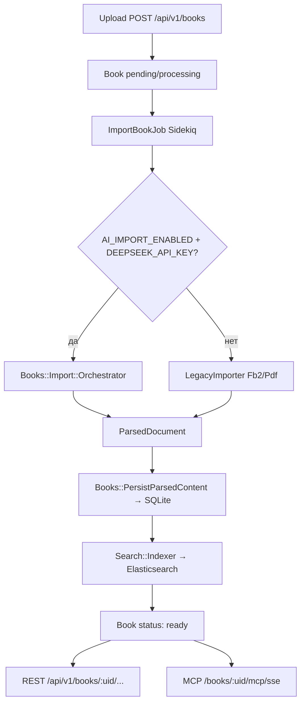

# Архитектура

## Назначение

**dynamic-mcp** — Rails 8 приложение, которое:

- принимает файлы книг (FB2, PDF, …);
- извлекает оглавление, страницы и метаданные;
- индексирует текст для полнотекстового поиска;
- отдаёт данные через REST и MCP (один endpoint на книгу).

Каждая книга идентифицируется публичным **`uid`** (`SecureRandom.urlsafe_base64(32)`).

## Стек

| Компонент | Роль |
|-----------|------|
| **Rails + Puma** (`web`) | HTTP, UI загрузки, REST API, MCP middleware |
| **Sidekiq** (`sidekiq`) | Фоновый импорт книг |
| **Redis** | Очередь Sidekiq |
| **SQLite** | Книги, секции, страницы, импорты (`storage/` volume) |
| **Elasticsearch 8** | Полнотекстовый поиск по страницам |
| **Docker sandbox** | Безопасный запуск AI-сгенерированных Ruby-парсеров |
| **DeepSeek + ActiveHarness** | LLM-агенты для AI-импорта |

Запуск только через **`docker-compose`** (с дефисом).

## Контейнеры (docker-compose)

```
redis ──┬── web ────────► :3020 → Puma
        ├── sidekiq ────► ImportBookJob (+ docker.sock для sandbox)
        ├── web_migrate ► db:prepare (one-shot)
        └── elasticsearch (внутренняя сеть, :9200 не наружу)

parser_sandbox ── образ для `docker run` из sidekiq (profile build-only)
```

Volumes:

- `app_storage` — SQLite + Active Storage (загруженные файлы)
- `es_data` — индекс Elasticsearch
- `redis_data`

## Поток данных



## Контракт данных: ParsedDocument

Импорт любым способом должен вернуть:

```ruby
Books::ParsedDocument = Data.define(:title, :author, :sections, :reading_text, :pages)
Books::ParsedSection  = Data.define(:title, :plain_text, :depth, :position, :path,
                                    :children, :page_start, :page_end)
```

- **FB2** — виртуальные страницы (~1800 символов), дерево `<section>`.
- **PDF** — физические страницы PDF, секции с `page_start` / `page_end`.

Persist и индексация **не зависят** от способа парсинга.

## Основные модели

| Модель | Назначение |
|--------|------------|
| `Book` | uid, title, author, source_format, status (`pending` / `processing` / `ready` / `error`) |
| `Section` | Дерево оглавления |
| `Page` | Текст страницы (номер + body) |
| `BookImport` | Состояние AI/legacy импорта, generated_script, iteration, отчёты |
| `BookImportEvent` | Лог шагов (toc, script_iteration, persist, …) |
| `ParserScriptSample` | Библиотека успешных Ruby-парсеров по формату |

## Слои приложения

### HTTP

| Путь | Контроллер |
|------|------------|
| `/` | `UploadsController#new` — форма |
| `POST /upload` | создание книги + redirect на статус |
| `/uploads/:uid` | UI прогресса импорта |
| `/uploads/:uid/status` | JSON для polling |
| `/api/v1/books` | REST API |
| `/books/:uid/mcp` | HTML-документация MCP |
| `/books/:uid/mcp/sse` | MCP SSE (fast-mcp middleware) |

### Импорт

| Класс | Роль |
|-------|------|
| `Books::CreateFromUpload` | Создание Book + Active Storage |
| `ImportBookJob` | Sidekiq entry point |
| `Books::Import::Runner` | Выбор AI vs legacy |
| `Books::Import::Orchestrator` | Полный AI-pipeline |
| `Books::Import::LegacyImporter` | Fb2::Importer / Pdf::Importer |
| `Books::PersistParsedContent` | Запись в БД |
| `Search::Indexer` | ES index `dynamic_mcp_books` |

### MCP

- `Mcp::BookMiddleware` — маршрутизация по uid
- `Mcp::Tools` — book_info, list_toc, search_fulltext, get_page, …
- `config/initializers/mcp.rb` — константы сервера

## Переменные окружения (ключевые)

| Переменная | Эффект |
|------------|--------|
| `AI_IMPORT_ENABLED` | `true` — пробовать AI (нужен ключ) |
| `DEEPSEEK_API_KEY` | Без ключа → только legacy |
| `PARSER_SANDBOX_IMAGE` | Образ для `docker run` парсера |
| `BOOK_IMPORT_HOST_WORKDIR` | Путь на **хосте** для mount в sandbox (production) |
| `WEB_PORT` | Порт на хосте (3020) |
| `ELASTICSEARCH_URL` | В compose: `http://elasticsearch:9200` |

Подробнее: [DEPLOY.md](DEPLOY.md), [AI_IMPORT.md](AI_IMPORT.md).

## Файловая структура (важное)

```
app/
  ai/agents/books/import/     # ActiveHarness агенты
  ai/prompts/books/import/    # System prompts
  jobs/import_book_job.rb
  services/books/import/      # Orchestrator, validators, script runner
  services/mcp/               # MCP tools
  middleware/mcp/             # Book-scoped MCP
config/books/import_output_schema.json
docker/parser-sandbox/        # Ruby + pdf-reader + nokogiri
docs/                         # Эта документация
deploy.sh                     # Деплой на сервер
```
